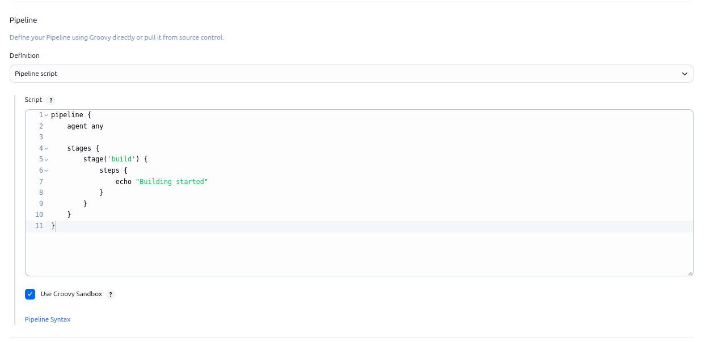
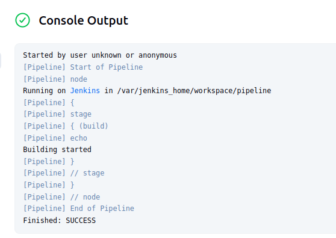
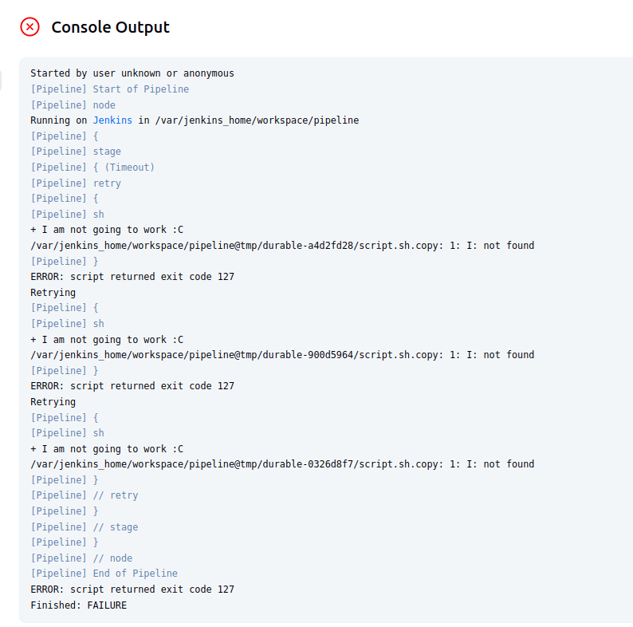
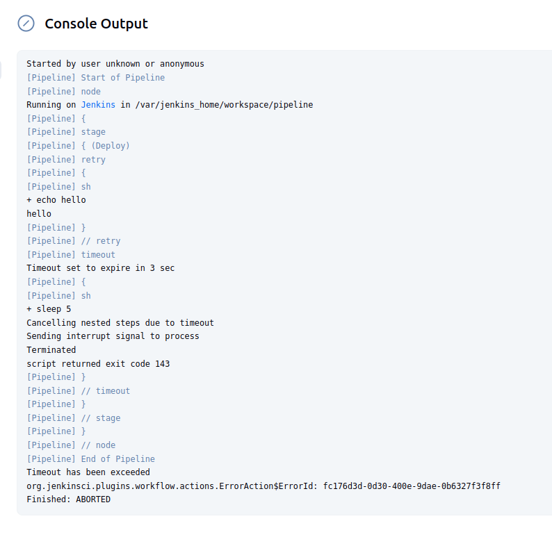
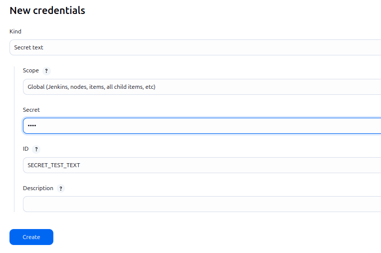
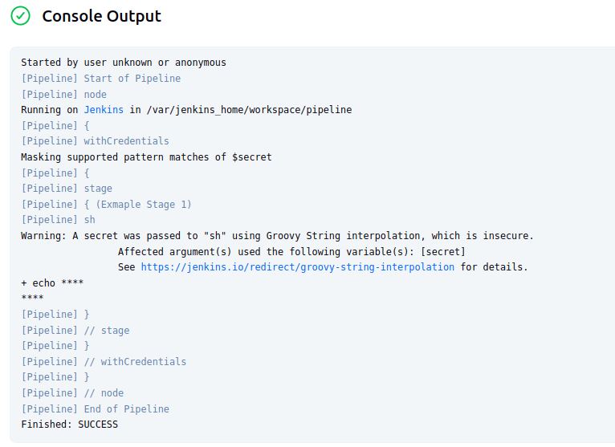

# Jenkins Pipeline

Jenkins pipeline is basicly a script that you give information about what you want to do in what order and then create this. 
Here we can see more in this example pipeline:

```
pipeline {
    agent any

    stages {
        stage('build') {
            steps {
                echo "Building started"
            }
        }
    }
}
```

The `pipeline` block defines a Declarative Pipeline, which is a structured and more readable way to write Jenkins Pipelines.

The `agent any` statement tells Jenkins to run the pipeline (or stage) on any available agent (Jenkins node).

The `stages` block contains one or more `stage` blocks, each representing a major phase of the pipeline (e.g., build, test, deploy).

Inside each `stage`, the `steps` block defines the actual commands or scripts to execute.

Steps are executed sequentially, one after another — like a queue.

--- 

After learning what this components do we can go ahead and create our pipeline job in jenkins like this:



And this is the output:



---
### Retry
```
pipeline {
    agent any

    stages {
        stage('Timeout') {
            steps {
                retry(3)
                {
                    sh "I am not going to work :C"
                }
            }
        }
    }
}
```
Retry will be handy when we need to retry some action that is not completed. If we run the command above, this is the output:



Here we can see that our job tried to run command for 3 times but it failed all of them since the commands is broken.

--- 
### Timeout

```
pipeline {
    agent any
    environments 
    stages{
        stage('Deploy') {
            steps {
                sh "echo hellooo"
            }
        }
    }
}
```

Timeout is also might be handy where we need to wait for specific length in a situation. This is the output for this pipeline job:



It aborted because timeout exceeded because we told to pipeline to wait for 3 seconds but command took 5 seconds to finish therefor its aborted.

--- 

### Credentials

```
pipeline {
    agent any
    environment {
        secret = credentials("SECRET_TEST_TEXT")
    }
    stages{
        stage('Exmaple Stage 1') {
            steps {
                sh "echo $secret"
            }
        }
    }
}
```

We can use our credentials that we created on jenkins. This process actually adds another layer to our security. This is how we can create a new credential with the password `1234`:



And after that we can run our pipeline and see  :



---

### Post Actions


```
pipeline {
    agent any   
    stages{
        stage('Test') {
            steps {
                sh "echo Fail; exit 1;"
            }
        }
    }
    post{
        always{
            echo "Always"
        }
        success{
            echo "Success"
        }
        failure{
            echo "Failure!!"
        }
        unstable{
            echo "Unstable"
        }
    }
}
```

Here we can create post actions which acts based on the current status of the job itself. 

In error situation, `always` and `failure` runs. In no error, `always` and `success` blocks runs.
 