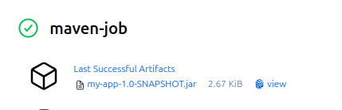

# Contents

## Creating a Maven Job

First we need to create a new jenkins job. For this purpose, we can use this [github link](https://github.com/jenkins-docs/simple-java-maven-app).
We need to paste this url inside our jenkins job like this:


And if we save and build this job this is our current output:


## Building JAR Using Maven

First we have to let jenkins now which version maven will it use like this:


And then we have to add a build step like this:


And this is the output of our build:

```
[INFO] Building jar: /var/jenkins_home/workspace/maven-job/target/my-app-1.0-SNAPSHOT.jar
[INFO] ------------------------------------------------------------------------
[INFO] BUILD SUCCESS
[INFO] ------------------------------------------------------------------------
[INFO] Total time:  25.155 s
[INFO] Finished at: 2025-04-30T12:53:57Z
[INFO] ------------------------------------------------------------------------
Finished: SUCCESS
```

In this commands we clearly see that our jar file is created and saved in our workspace file path.

## Adding Tests to the Jenkins Job

We have to add another build step to our jenkins job like this:


What it does is actually pretty simple. In the given github repo, there is a test folder inside `src/`. And when we basicly say `test` as a goal, maven understands this and goes for this file to run tests.

When we run this immediatly, we will get an error. Its a problem about java i guess. In `manage jenkins -> Sysmem -> Global Properties -> Add a new environment variable`.

```
_JAVA_OPTIONS_=-Djdk.net.URLClassPath.disableClassPathURLCheck=true
```

This is how it looks like:


## Deploying the JAR Locally

If there was no problem with the tests, we aim to deploy our jar with this code:

```bash
echo "*****************************"
echo "Deploying JAR"
echo "*****************************"

java -jar /var/jenkins_home/workspace/maven-job/target/my-app-1.0-SNAPSHOT.jar
```

And we can see the output like this:


## Adding a Graph to Show Tests Results

If we look into our job directory inside out jenkins container, we can see our logs at this file path `workspace/[job_name]/target/surefire-reports/`. And we can use this file to create graphs!


And this is how our graph looks like!

## Acrhiving the Last Successfull Artifact

We can create a post-build action that activates when the build is successfull like this:


And here we can see our last successfull build as a jar:

