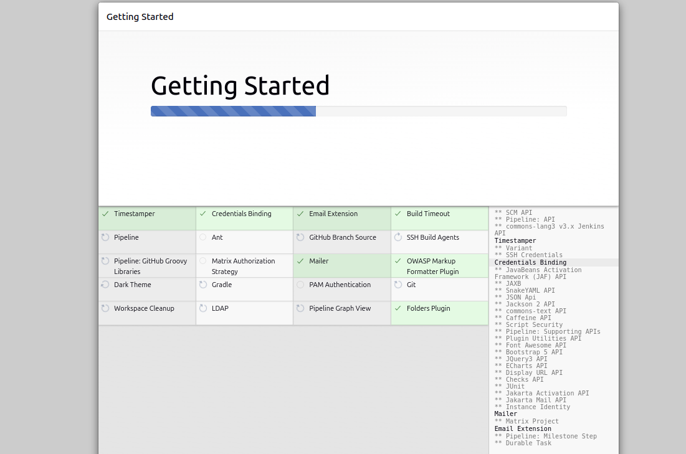
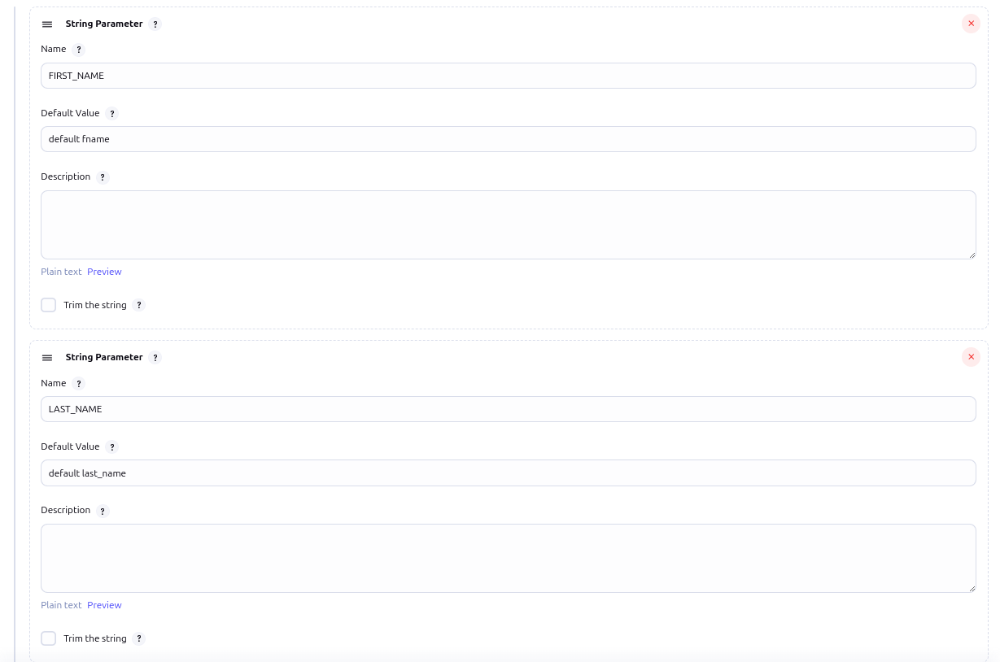
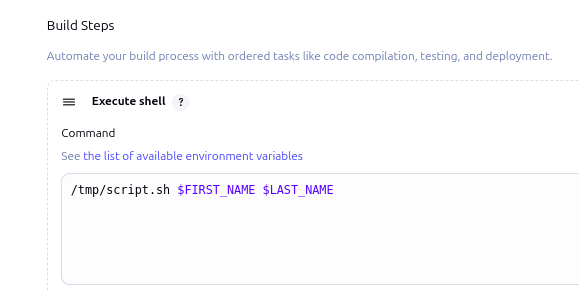
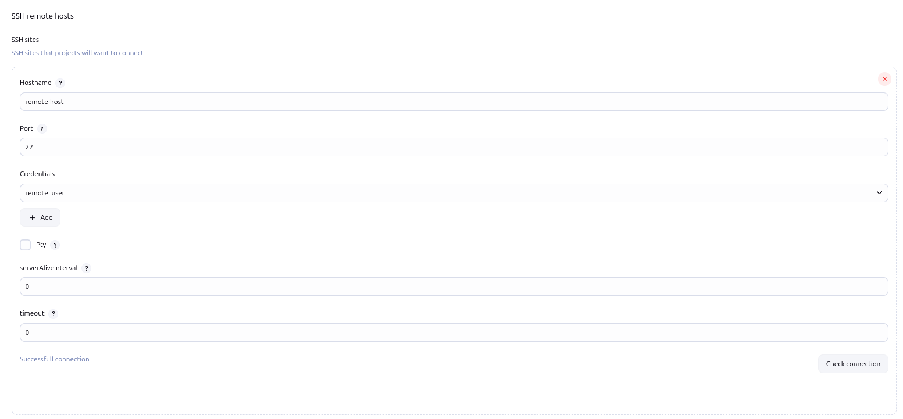
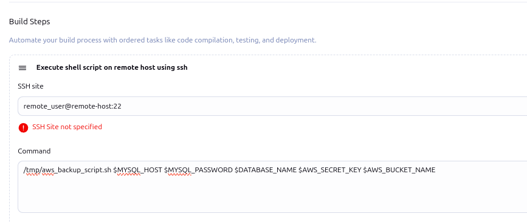

# Jenkins & Ansible Lab 1

## Contents

- [1. Introduction](#introduction)
- [2. Creating basic job](#creating-basic-job)
- [3. Creating Container From Fedore OS](#creating-container-from-fedore-os)
- [4. Creating MySql Server in Docker](#creating-mysql-server-in-docker)
- [5. Adding Ansible to our jenkins container](#adding-ansible-to-our-jenkins-container)
- [6. remote-key Consistency](#remote-key-consistency)
- [7. Creating our first inventory in Ansible](#creating-our-first-inventory-in-ansible)
- [8. What is Ansible Playbook?](#what-is-ansible-playbook)
- [9. Creating Jenkins Job While Using Ansible Playbook](#creating-jenkins-job-while-using-ansible-playbook)
- [10. Adding Parameters to the Jenkins Job](#adding-parameters-to-the-jenkins-job)
- [11. Creating Multi App Example](#creating-multi-app-example)
- [12. Creating Nginx Container](#creating-nginx-container)
- [13. Integrate Docker Web Service to the Ansible Inventory](#integrate-docker-web-service-to-the-ansible-inventory)
- [14. Testing our playbook](#testing-our-playbook)
- [15. Creating Jenkins Job to Build Everything with a Click](#creating-jenkins-job-to-build-everything-with-a-click)

---

## 1. Introduction

First, we created the Jenkins container using our current `docker-compose.yaml` file. After executing `docker compose up -d`, the Jenkins container becomes active. Then we proceed to install the needed plugins using the given key from the Jenkins container.



---

## 2. Creating basic job

We can create a script on our host machine:

```bash
#!/bin/bash
NAME=$1
LASTNAME=$2
echo "Hello, $NAME $LASTNAME"
```

And copy this script like this to our jenkins container:

```bash
docker cp basic_script.sh jenkins:/tmp/script.sh
```

In our jenkins client, we can parameterise our job like this and we will have 2 different variable called `FIRST_NAME` and `LAST_NAME`



Add a build step to execute the shell script:



We can access this variables. If we build this job, we can see an output like this:

<p align="center">
  
  
</p>

---

## 3. Creating Container From Fedore OS

We create new Dockerfile for fedora container at `fedora/Dockerfile` and we update our docker-compose file for remote-host container.

After editing Dockerfile in fedora file path, we can creat a ssh key using:

```bash
ssh-keygen -t rsa -m PEM -f remote-key
```
If you guys counter any error that stops jenkins container running, this might be because of the jenkins doesn't have rights to write onto the file `jenkins_home`. So to solve this we basicly use this command:

```bash
sudo chown -R 1000:1000 ./jenkins_home
```

We are giving needed permission of the jenkins container to write or read from this file path.


As we can see, our both jenkins and remote-host container is running. We can access remote-host from jenkins container:


We can copy remote-key file inside of our jenkins container and we can use this file for accessing remote-host container.  

The reason we are doing this is to actaully access this remote-host via jenkins for job usage. In future, we actually gonna use ansible for ssh connections. 

---

Now we can add ssh remote host from jenkins configuration page:



If we give the information inside the job's configuration to use ssh and enter basic command:

<p align="center">
  
  
</p>

We can see here that our job is worked out and we can communicate with remote-host container via our jenkins container! That's greatt!!!

--- 

## 4. Creating MySql Server in Docker

We updated our docker-compose.yaml file like this:

```yaml
db_host:
    container_name: db
    image: mysql
    environment:
    - "MYSQL_ROOT_PASSWORD=1234"
    volumes:
    - $PWD/db_data:/var/lib/mysql
    networks:
    - net
```

And when we do:

```bash
docker compose down
docker compose up -d
```

We can see that our services is up:


We just added needed AWS tools in our remote-host container like this:

```bash
RUN yum -y install mysql

RUN yum -y install python3-pip && \
    pip3 install --upgrade pip && \
    pip3 install awscli
```

If we go into our remote-host bash and connect to the mysql container using this command:

```bash
mysql -u root -h db_host -p 
```

this will ask us a password which we set it to 1234, then we are inside the mysql. Now we can create sample database and input some data into db like this:

```sql
create database testdb;
use testdb;
create table info(name varchar(20), lastname varchar(20), age int(2)); 
insert into info values ('mandalina', 'lastname', 22); 
# and with last command, we can see inside of our table
SELECT * FROM info;
``` 
Okey, we just created our database and inserted some information. 

### What to do next? 
---

To make more complex operation, we can create a db backup and send this backup to the AWS S3 service. After creating S3 bucket. We will create a simple script for this occasion in `aws_backup_script.sh`.

But before running this script in jenkins job, we need more security for our secret keys and passwords, for that we can use jenkins' credentials:

<p align="center">
  
  
</p>

Our script takes 5 arguments to run, we created 2 of them using credentials in jenkins 

| Variable      | Description                          |
|---------------|--------------------------------------|
| DB_PASSWORD   | Created inside Jenkins credentials   |
| AWS_SECRET    | Created inside Jenkins credentials   |
| DB_HOST       |
| DB_NAME       |
| BUCKET_NAME   |


So for the rest of the variables, we are creating variable inside our job confiration on jenkins. After creating, this is our situation:


| Variable      | Description                          |
|---------------|--------------------------------------|
| DB_PASSWORD   | Created inside Jenkins credentials   |
| AWS_SECRET    | Created inside Jenkins credentials   |
| DB_HOST       | Created variable inside Jenkins job  |
| DB_NAME       | Created variable inside Jenkins job  |
| BUCKET_NAME   | Created variable inside Jenkins job  |

In build settings, we also configuring the `Execute shell script on remote host using ssh` like this:



If you get an error, don't worry. You forgot to give the appropiate permissions like me :')

```bash
chmod +x aws_backup_script.sh 
```

Ups! I forgot to add bindings in job configurations. Our job doesn't know what credentials to use soo we are using bindings like this:

  

But now our job can access all of our variables and run smoothly!

  

And if we look into our bucket on AWS S3, we can see our uploaded object: 


We created our jenkins job in a way that get 2 credentials variable from jenkins configurations and 3 variable as a job input. But wait!

### What does that mean?


| Variable      | Source              | Description                          |
|---------------|---------------------|--------------------------------------|
| `DB_PASSWORD` | Jenkins Credentials | Root password for the database       |
| `AWS_SECRET`  | Jenkins Credentials | AWS Secret Key for S3 access         |
| `DB_HOST`     | Job Input           | Hostname of the database             |
| `DB_NAME`     | Job Input           | Name of the database to back up      |
| `BUCKET_NAME` | Job Input           | Target AWS S3 bucket name            |


By doing this like this, we can create a backup of any database we want actually. If there is database itself, its so easy for us to specify which database to backup. Jenkins is really flexible for this stuff and i love ittt! 

## 5. Adding Ansible to our jenkins container

We created new directory `jenkins-ansible` and inside that directory, we created a new Dockerfile file with configurations for ansible + jenkins. And updated our docker-compose file.

After building and running our container, we can check ansible like this:

```bash
docker exec -it jenkins bash
ansible
```

The output shows us that we successfully installed ansible to our container, but its not over yet. Now we have to tell jenkins that it can communicate with ansible via installing a plugin:


<p align="center">
  
  
</p>

## 6. remote-key Consistency

While connecting to our remote-host container, we always in need of remote-key file. For this reason, we can create a new directory inside our jenkins-ansible dir and add remote-key file into there. This way when our container restarts, we can always have the remote-key file in the palm of our hands. 

```bash

mkdir jenkins_home/ansible
cp fedora/remote-key jenkins_home/ansible/
```

### ⚠️ Important Note

After copying the `remote-key` file into the mounted Jenkins volume, we need to ensure that the **Jenkins user inside the container** has the correct permissions to access and use the key.

Use the following command to apply the necessary file mode and ownership:

```bash
docker exec \                         # Run a command inside a container
  -u root \                           # Execute as the root user
  jenkins \                           # Target container named "jenkins"
  bash -c \                           # Run using bash shell
  "chmod 400 /var/jenkins_home/ansible/remote-key && \
   chown 1000:1000 /var/jenkins_home/ansible -R"
```
## 7. Creating our first inventory in Ansible

After creating our `fedora/hosts` file, we copy this file into our jenkins container like this:

```bash
cp hosts ../jenkins_home/ansible/
``` 
### What is this hosts file?

This file called inventory. Basicly its a file that holds our host information and our configurations like host user name and remote-key. 

If we get inside our jenkins container and try to ping our remote-host:

```bash 
docker exec -it jenkins bash
```
```bash
cd 
cd ansible/
ansible -i hosts -m ping test1
```

If you are with me until this point, you will get this output saying that its working:


## 8. What is Ansible Playbook?

An Ansible playbook is a configuration file written in YAML that defines a series of tasks to be executed on remote hosts. 
Playbooks allow you to automate complex processes, using the inventory (host) file to know which machines to target.

After creating our play.yaml file at `jenkins-ansible/play.yaml`, we can copy it inside of our jenkins container:

```bash
cd jenkins-ansible/
cp play.yaml ../jenkins_home/ansible/
```

And after going inside our container:

```bash
docker exec -it jenkins bash
```

```bash 
cd
cd ansible/
ansible-playbook -i hosts play.yaml
```


In the image we can see that our playbook successfully runned.

## 9. Creating Jenkins Job While Using Ansible Playbook

In configuration of our job, we add `Invoke Ansible Playbook`.

  

This is how we do it and if we build this job and get into our remote-host container and then try to look for created file, we can find `hello.txt` there like this:

<p align="center">
  
  
</p>

## 10. Adding Parameters to the Jenkins Job

After chaning our play.yaml file to this:

```yaml
- hosts: test1
  tasks:
    - name: Show custom message
      debug:
        msg: "{{MSG}}"
```
And after saying `This project is parameterised` and creating a new variable called ANSIBLE_MESSAGE, later we have to give this variable to our playbook via `Advanced -> Add Extra Parameter` like in the images below.

<p align="center">
  
  
</p>

If we run our job with specific information, we will be given output like this:


<p align="center">
  
  
</p>

## 11. Creating Multi App Example

First we need to login into our db container:

```bash
docker exec -it db bash
```

```bash
mysql -u root -p
# enter your password
```

And create database and table inside there:

```bash
create database people;
use people;
create table register (id int(3), name varchar(50), lastname varchar(50), age int(3));
# to see out table
desc register;
```


### Adding data into our newly created database

We created a new file containing our script for loading data to database. We also have `people.txt` as data itself.

We have to give needed permissions to our file:

```bash
chmod +x put.sh
# and we can copy our script to db container like this:
docker cp put.sh db:/tmp
# and also our people.txt file too:
docker cp people.txt db:/tmp
docker exec -it db bash
```

```bash
cd /tmp/
# and then to load our data into our database:
./put.sh
```

You will get a output something like this. Aaaaannndddd if we run `SELECT * FROM register`:

<p align="center">
  
  
</p>

## 12. Creating Nginx Container

We just created necessary files inside our `jenkins-ansible` folder just like this:

    web/
    ├── bin/
    │   └── start.sh
    ├── conf/
    │   ├── nginx.conf
    │   ├── nginx.repo
    └── Dockerfile

After creating new files, for our newly created container to run we have to update our docker-compose.yaml file with this lines:

```yaml
web: 
    container_name: web
    image: ansible-web
    build:
      context: jenkins-ansible/web
    ports:
      - "80:80"
    networks:
      - net
```

After 

```bash 
docker compose down
docker compose up -d
```
Our containers are ready!

And now we get into our web container and add this php code inside index.html to see if our system is working:

```php
<?php

// Show all information, defaults to INFO_ALL
phpinfo();

// Show just the module information.
// phpinfo(8) yields identical results.
phpinfo(INFO_MODULES);

?>
```

```bash 
docker exec -it web bash
```

```bash 
cd /var/www/html/
vi index.php
```


And with this image we can see that our php is active and running nicely.

--- 

After creating table.j2 file, we have to copy this file inside our container like this:

```bash 
docker cp table.j2 web:/var/www/html/index.php
```

And with this, we can see the output at our `localhost` like this:


## 13. Integrate Docker Web Service to the Ansible Inventory

First we need to add our newly created host to our hosts file at `jenkins_home/ansible/hosts` like this:

```
web1 ansible_host=web ansible_user=remote_user ansible_private_key_file=/var/jenkins_home/ansible/remote-key
```

Only difference from our test1 host is web1 uses `web` as a ansible_host.

And to check out our updated hosts file:

```bash
docker exec -it jenkins bash
```
```bash
cd ansible/
ansible -m ping -i hosts web1
```

This will prompt us a information saying that our ping has arrived to our destination host:


## 14. Testing our playbook

To test our playbook, first we need to copy `table.j2`:
```bash
cp table.j2 ../jenkins_home/ansible/
cd jenkins_home/ansible
vi people.yml
```
```yml
- hosts: web1
  tasks:
    - name: Tranfer template to web server
      template:
        src: table.j2
        dest: /var/www/html/index.php
```
In order to our commands work precisely, we need to do this also:

```bash
docker exec -it web bash
cd /var/www/
chown remote_user:remote_user /var/www/html/ -R 
```
And now we can check our playbook:
```bash
docker exec -it jenkins bash
cd 
cd ansible/
ansible-playbook -i hosts people.yml
```

In here we can see that our playbook works just fine!


## 15. Creating Jenkins Job to Build Everything with a Click

After creating a job, we specify a variable called age with choices:


Then we add build step as `Invoke Ansible Playbook` and after configuring our ansible playbook, we add extra parameter like this:


Now all we have to do is build our job with parameter:


With this, we can see that our job is configured nicely and works smoothly.


